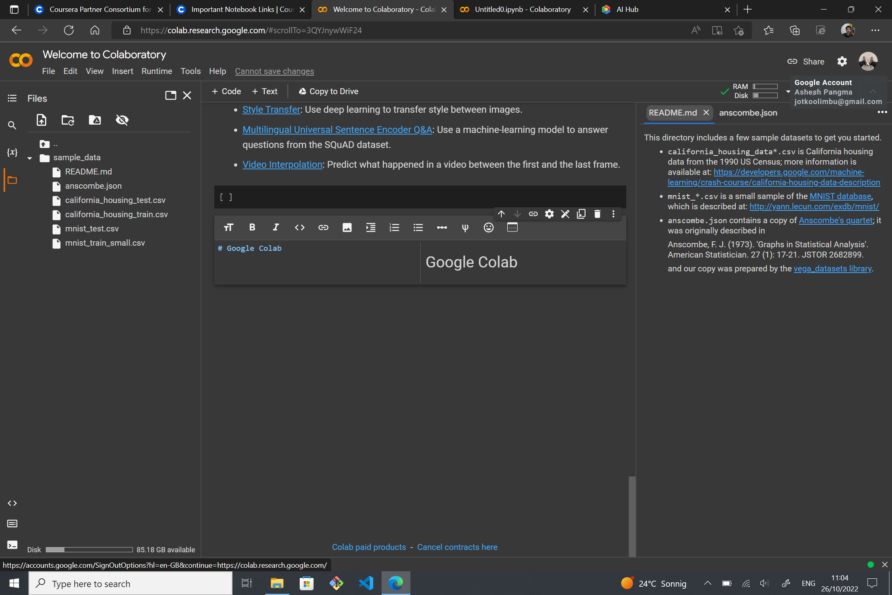

# Web Application and Command-Line Tool

## Week 1

### Introductio to Jupyter Notebook

#### Code Cells in Jupyter

Jupyter notebook contains executable documents, Cells, Code, text and images. The kernel comprise of Python, R or Julia.

To install Jupyter notebook, type:
```
pip install jupyter
```
To run Jupyter notebook, type:
```
jupyter notebook
```
Then the Jupyter notebook prompt will open. Choose python3 kernel and proceed.
To run codes in the cell, press the "run" button or press "shift+enter".

To see all the directories in os, type the following:
```
import os
os.listdir()
```

To read a csv file:
```
import pandas as pd
df = pd.read_csv('path/file_name.csv')
df
```

`!ls` commands list all the files in the current directory.

To print the working directory, type the following:
```
curl_pwd = !pwd
print(curl_pwd)
```

#### Text Cells in Jupyter

In this section we learned about markdown files in Jupyter notebook. To use a cell as markdown from the dropdown menu select "Markdown". Then, proceed with the text as markdown file.
To include link, type:
`.[Duke.org](link)`

To include image, type:
`!.[Duke_Image](./filename.png)`

#### Magics in Jupyter

To run Magics command in Jupyter notebook we usr "%" symbol. A single "%" for single line command and "%%" for command in a cell. To view all the commands available in magic, type `%lsmagic` in the cell and run the command.
`%timeit` command can be used to view the time required to execute the code. For example:
`% timeit [x for x in range(1000)]`
```
%%timeit
for x in range(10000):
    z = x + 1
```
An example showing write to a file is shown below:
```
%%writefile hello.py

def say_hello():
    print("hello")
    
say_hello()
```
To run the python file, type `%run filename.py` in the cell and run it.

```
%env
```
```
%env USER_KEY=1234
%env USER_KEY
```
To run Ruby code in the cell, we run magic script followed by code in Ruby as follows:
```
%%script ruby
puts "Hello!"
```

#### Overview of Jupyter Lab

To install Jupyterlab, type `pip install jupyterlab` in the prompt. After installing Jupyterlab, you can run it by using the command `jupyter lab`. Then a prompt will open showing Jupyterlab. It provides several windows to work similar to that of an IDE. We can debug our code as well as add other extensions on Jupyterlab for better experience.
The picture below shows the prompt for Jupyterlab.


## Week 2

### Google Colab

#### Introduction to Google Colab

Google Colab is managed environment hosted in the cloud with preinstalled data science packages. It provides python only kernel and is free to use. The files are shareable and stored in google drive. It also provides a wide ecosystem of shared collection that we can use in our projects. AI Hub(Seedbank) is a shared ecosystem for google colab. The link is given below:
https://aihub.cloud.google.com
The picture below shows prompt for google colab:


#### Colab Features

To access colab use the following link:
https://colab.research.google.com

We can select any notebook and open it or upload it from our local drive. Colab notebook are python based and the layout is similar to jupyter notebook. The notebook is saved in certain interval automatically. 
We can also add text cell and code cell directly. The preview of mark down is shown without running the cell.
Google colab also provide code snippets that can be loaded in our notebook and run.

#### Data and Documents

We are provided with sample data by google. We can view the data sample. Also, we can directly mount to our google drive and the files are added to the notebook. We can also write documents in the google drive.
We can upload individual file from our local drive. These uploaded files are not preserved in between sessions so we will need to obtain it again to reuse it. Since the colab files are by default saved in google drive, we will have a colab notebook directory in our google drive created automatically. We can also save the file in Github or Github Gist or download the file as python file or jupyter notebook file.
Google colab also provieds an option to view revision history from where we can see the changes made in our code. It is also possible to directly upload jupyter notebook to google colab from our local disk and work on it.


### AWS SageMaker

#### Introduction to SageMaker

It is AWS hosted notebook environment and unlike google colab, it provides several kernels for notebook and it is not free. AWS SageMAker is designed for constructing Machine learning pipelines on AWS infrastructure. 
To use SageMaker we first need to set up SageMaker domain. We can then create a note book or use an existing notebook. We will have an option to select Notebook instance type where we can choose between various instances. The instance type are compute optimized, memory optimized and accelerated computing. We are charged according to the instance type we choose. 
AWS provide a special SDK to access machine learning tools, tools for training and building models, tools for accessing resources in AWS, etc.
```
import sagemaker
```
To find the environment where we are running our notebook on:
```
session = sagemaker.Session()
session.boto_region_name
```

#### SAgeMaker Studio

We can launch SageMaker studio form SageMaker domain. Amazon SageMaker prompt looks similar to Jupyterlab. However, it provides some additional features. In SageMaker studio, we can have multiple notebook running multiple kernels at the same time. SageMaker Jumpstart is a collection of example models, notebook, videos and blogs that help us to use SageMaker studio.

#### SageMaker Pipelines

To use pipelines we need to create a project. SageMaker studio provides template projects that we can use for many common situation. We can view pipeline node to get information about the node, input to the node, its output and logs for the node. 
SageMaker pipeline help us to wrap up data science operation in deployable manner, that can be repeated and worthy of production code.


## Week 3


## Week 4


